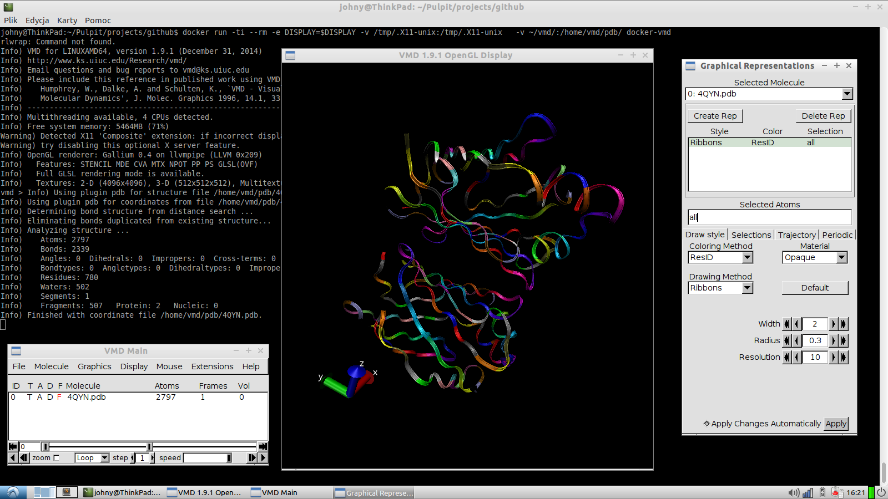

docker-vmd
============

Visual Molecular Dynamics in Docker Container


  VMD is designed for the visualization and analysis of biological
systems such as proteins, nucleic acids, lipid bilayer assemblies,
etc.  It may be used to view more general molecules, as VMD can read
standard Protein Data Bank (PDB) files and display the contained
structure.  VMD provides a wide variety of methods for rendering and
coloring molecule.  VMD can be used to animate and analyze the trajectory 
of molecular dynamics (MD) simulations, and can interactively manipulate
molecules being simulated on remote computers (Interactive MD).


Why it was created?
---------------------------------------------

This project is [another](http://blog.0x1fff.com/2009/09/vmd-package-builder-for-ubuntu-and.html) quick and dirty solution to create VMD container almost from scratch. 
It compiles provided VMD sources and creates Debian package (*.deb) which is later installed in container. 
If you are planing to build VMD Debian package for distribution you should rather use [vmd-debian](https://github.com/ziima/vmd-debian) project - it is better suited for deb package distribution.


Building VMD container image (Ubuntu host)
---------------------------------------------

```bash
## Remove standard Ubuntu Docker installation and install most recent Docker
sudo apt-get purge docker.io
curl -s https://get.docker.io/ubuntu/ | sudo sh

## Create enviroment for docker-vmd container build
mkdir vmd_build
cd vmd_build
git clone https://github.com/0x1fff/docker-vmd.git

## Download vmd source from proper place
cp vmd-*src.tar.gz .

## Start HTTP server with vmd sources
python -m SimpleHTTPServer 9090 &
PY_HTTP=$!

## Build docker image (Dockerfile may require minor changes - UID / GID / HTTP PROXY)
sudo docker build -t docker-vmd docker-vmd

## Shutdown HTTP server
kill $PY_HTTP
```


Starting VMD container (Ubuntu host)
---------------------------------------------

### Creating VMD container with home volume and X forwarding
```bash
docker run -ti --rm -e DISPLAY=$DISPLAY -v /tmp/.X11-unix:/tmp/.X11-unix -v ~/:/home/vmd docker-vmd
```

Is it working?
---------------------------------------------

Yes!




Tested VMD versions
---------------------------------------------

 * vmd-1.8.7.src.tar.gz - (md5sum: e8da2f2a5ffd5b4b2562eec77bbea8a3) :white_check_mark:
 * vmd-1.9.1.src.tar.gz - (md5sum: 661a3836df6598bad0bf15eca4d2f890) :white_check_mark:
 * vmd-1.9.src.tar.gz - (md5sum: ad52f695bdab5b94b860f82e88ed5c18) :white_check_mark:
 * vmd-1.9.2beta1.src.tar.gz - (md5sum: 799628156ae05cba7760772c71daa540) :white_check_mark:


Other related projects
---------------------------

* [Debian package data for VMD - Visual molecular dynamics](https://github.com/ziima/vmd-debian)
* [Debian package data for NAMD - Scalable molecular dynamics](https://github.com/ziima/namd-debian)
* [Unofficial source code of VMD @GitHub](https://github.com/thatchristoph/vmd-cvs-github)
* [Official source code of VMD](http://www.ks.uiuc.edu/Development/Download/download.cgi?PackageName=VMD)
* [Unofficial source code of NAMD @GitHub](https://github.com/thatchristoph/namd2-cvs-github)
* [Official source code of NAMD](http://www.ks.uiuc.edu/Development/Download/download.cgi?PackageName=NAMD)


Additional references about Docker
-------------------------------------------
 
 * [Building docker images using http cache](http://stackoverflow.com/questions/22030931/how-to-rebuild-dockerfile-quick-by-using-cache)
 * [Building good Docker images](http://jonathan.bergknoff.com/journal/building-good-docker-images)
 * [6 tips for building good Docker images](http://container-solutions.com/2014/11/6-dockerfile-tips-official-images/)
 * [Sandboxing proprietary applications in Docker](http://www.jann.cc/2014/09/06/sandboxing_proprietary_applications_with_docker.html)
 * [Running GUI apps with Docker](http://fabiorehm.com/blog/2014/09/11/running-gui-apps-with-docker/)


License:
---------------------

License Apache License Version 2.0, January 2004 (https://tldrlegal.com/ ; http://choosealicense.com/)

